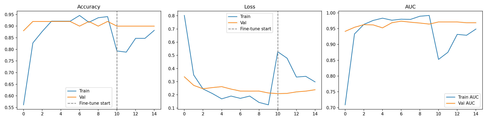
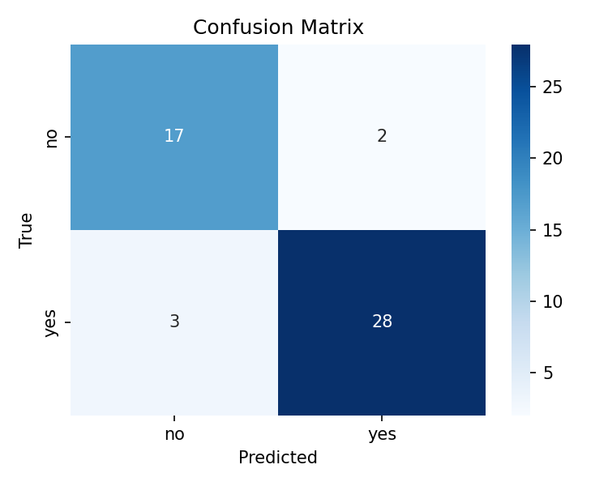

<h2 align="center">Brain Tumour Detection from MRI</h2>

  Binary classification of brain MRI images as <b>tumour</b> or <b>no tumour</b>
  using MobileNetV2 transfer learning with two-phase fine-tuning.

  <b>Dataset:</b> 
  <a href="https://www.kaggle.com/datasets/navoneel/brain-mri-images-for-brain-tumor-detection">
    Brain MRI Images for Brain Tumor Detection (Kaggle)
  </a>

<h3>🧠 Project Overview</h3>

This project builds a binary CNN classifier for brain tumour detection using
<b>MobileNetV2</b> (pretrained on ImageNet) as the backbone, implemented in
<b>TensorFlow/Keras</b>. Rather than training from scratch, transfer learning
allows strong performance even on a small dataset (~250 images) by reusing
features learned from millions of images.

Training is done in two phases:

<ol>
  <li><b>Phase 1 — Frozen base:</b> Only the custom classification head is trained while MobileNetV2 weights are frozen.</li>
  <li><b>Phase 2 — Fine-tuning:</b> The last 30 layers of MobileNetV2 are unfrozen and trained at a very low learning rate to adapt pretrained features to MRI data.</li>
</ol>

<h3>📈 Results</h3>
<table align="center">
  <tr>
    <th>Metric</th>
    <th>No Tumour</th>
    <th>Tumour</th>
    <th>Overall</th>
  </tr>
  <tr>
    <td>Precision</td>
    <td>0.85</td>
    <td>0.93</td>
    <td>—</td>
  </tr>
  <tr>
    <td>Recall</td>
    <td>0.89</td>
    <td>0.90</td>
    <td>—</td>
  </tr>
  <tr>
    <td>F1-Score</td>
    <td>0.87</td>
    <td>0.92</td>
    <td>—</td>
  </tr>
  <tr>
    <td>Accuracy</td>
    <td>—</td>
    <td>—</td>
    <td><b>90%</b></td>
  </tr>
  <tr>
    <td>AUC</td>
    <td>—</td>
    <td>—</td>
    <td><b>0.97</b></td>
  </tr>
</table>

  

<i>Training and validation accuracy, loss, and AUC across both phases. The dashed line marks the start of fine-tuning.</i>

  

<h3>🏗️ Model Architecture</h3>
<ul>
  <li><b>Backbone:</b> MobileNetV2 (ImageNet pretrained, top removed)</li>
  <li><b>Head:</b> GlobalAveragePooling → BatchNorm → Dense(128, ReLU) → Dropout(0.4) → Dense(1, Sigmoid)</li>
  <li><b>Total params:</b> 2.4M &nbsp;|&nbsp; <b>Trainable (Phase 1):</b> 166K</li>
</ul>

<h3>⚙️ Key Techniques</h3>
<ul>
  <li><b>Transfer learning</b> with MobileNetV2 pretrained on ImageNet</li>
  <li><b>Two-phase training</b> — frozen base then gradual fine-tuning</li>
  <li><b>Data augmentation</b> — rotation, flips, zoom, brightness, shear (training only)</li>
  <li><b>Class-weight balancing</b> via <code>compute_class_weight('balanced')</code></li>
  <li><b>Callbacks</b> — EarlyStopping and ReduceLROnPlateau</li>
</ul>

<h3>▶️ How to Run</h3>

<pre><code>pip install tensorflow scikit-learn seaborn matplotlib</code></pre>

Organise your dataset as:

<pre><code>brain_tumor_dataset/
    yes/   ← MRI images with tumour
    no/    ← MRI images without tumour
</code></pre>

Then run:

<pre><code>python brain_tumor_mobilenetv2.py</code></pre>

To test on a new image, place it as <code>test.jpg</code> in the project directory — the script will print the prediction score and display the result.

<h3>🛠️ Tools & Technologies</h3>
<ul>
  <li>Python 3.12</li>
  <li>TensorFlow / Keras</li>
  <li>MobileNetV2 (transfer learning)</li>
  <li>Scikit-learn (class weights, evaluation metrics)</li>
  <li>Seaborn / Matplotlib (visualisation)</li>
</ul>
